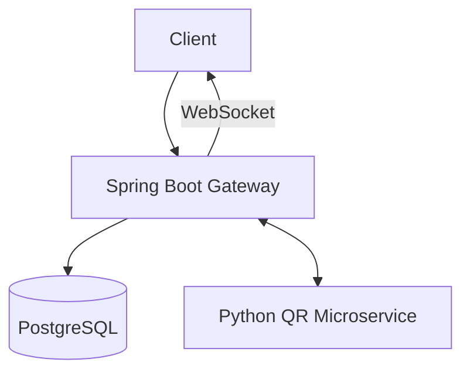

# Loyalty Bars System

A cloud-native loyalty points management application for partner bars. Customers accumulate points on purchases, redeem rewards, and track their history in real-time.

## 📋 Architecture

The system follows a microservices architecture orchestrated with Docker Compose.



### Components
1. **Gateway (Spring Boot)**:
   - REST API with OpenAPI/Swagger documentation.
   - Authentication & Authorization with JWT.
   - WebSocket for real-time notifications.
   - Business logic for bars, rewards, and transactions.
2. **QR Microservice (Python FastAPI)**:
   - Generates and validates unique QR codes.
   - Communicates with Gateway for transaction confirmation.
3. **Database (PostgreSQL)**:
   - Persistent storage for users, bars, transactions, and rewards.


## 🚀 Getting Started

### Prerequisites
- Docker & Docker Compose
- Java 21 (for local gateway development)
- Python 3.11+ (for local QR service development)

### One-Command Setup
1. Create a `.env` file from `.env.example`:
   ```bash
   cp .env.example .env
   ```
2. Start all services:
   ```bash
   docker-compose up -d
   ```

### API Documentation
Once the system is running, access the documentation at:
- **Gateway Swagger**: [http://localhost:8080/swagger-ui.html](http://localhost:8080/swagger-ui.html)
- **QR Service Docs**: [http://localhost:8000/docs](http://localhost:8000/docs)

## 📊 Observability
- **Health Checks**:
  - Gateway: `/actuator/health`
  - QR Service: `/health`
- **Metrics**: 
  - Gateway: `/actuator/prometheus` (Includes `loyalty.qrcodes.generated`, `loyalty.transactions.total`)
  - QR Service: `/metrics` (Prometheus format)
- **Logging**: Structured JSON logging in Docker environment.

## 🔐 Secret Management
- Secrets are managed via environment variables and `.env` files.
- No secrets are committed to the repository.
- GitHub Actions uses GitHub Secrets for CI/CD pipelines.

## 🔄 CI/CD
A GitHub Actions pipeline is configured to:
1. Run unit and integration tests for all services.
2. Build and push Docker images to GHCR.
3. Run security scans (Trivy).
